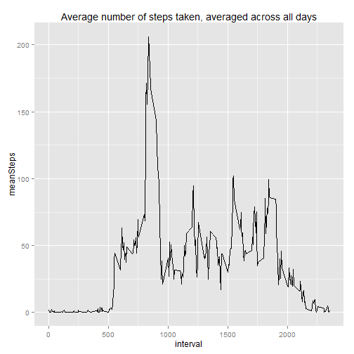
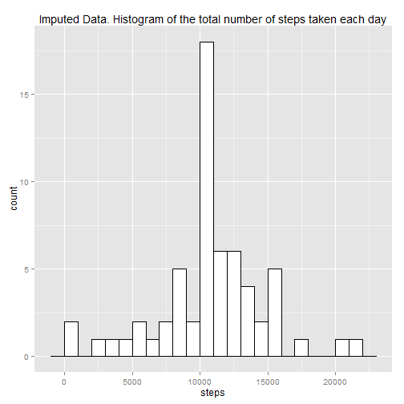

# Reproducible Research: Peer Assessment 1

## Prerequisites
I am going to use ggplot2 for ploting and data.table for subsetting, so I have to load it first.  
Also set up locale to make work with weekdays consistent.

```r
library(ggplot2)
library(data.table)

Sys.setlocale("LC_TIME", "us")
```

```
## [1] "English_United States.1252"
```


## Loading and preprocessing the data
First we need to unzip and read data.

```r
unzip("activity.zip")
activity <- data.table(read.csv("activity.csv"))
```


## What is mean total number of steps taken per day?


We have alot of NA's in the data, so we have to ignore them during computations by applying option **na.rm=TRUE**.  


```r

setkey(activity, date)
stepByDay <- activity[, sum(steps, na.rm = TRUE), date]

setnames(stepByDay, "V1", "steps")

p <- ggplot(stepByDay, aes(x = steps)) + geom_histogram(binwidth = 1000, colour = "black", 
    fill = "white") + ggtitle("Histogram of the total number of steps taken each day") + 
    theme(legend.position = "bottom")

p
```

 


Mean value is 

```r
mean(stepByDay$steps)
```

```
## [1] 9354
```


Median is

```r
median(stepByDay$steps)
```

```
## [1] 10395
```


## What is the average daily activity pattern?


```r
setkey(activity, interval)
stepByInt <- activity[, mean(steps, na.rm = TRUE), interval]
setnames(stepByInt, "V1", "meanSteps")

ggplot(stepByInt, aes(x = interval, y = meanSteps)) + geom_line() + ggtitle("Average number of steps taken, averaged across all days")
```

 


## Imputing missing values
Total number of missing values in the dataset

```r
table(is.na(activity$steps))["TRUE"]
```

```
## TRUE 
## 2304
```


Make a copy of activity data to eliminate NAs and substitute NAs there.

```r
actImpute <- activity

actImpute[is.na(steps)]$steps <- as.integer(mean(activity$steps, na.rm = TRUE))

stepByDayImpute <- actImpute[, sum(steps), date]
setnames(stepByDayImpute, "V1", "steps")

p %+% stepByDayImpute %+% ggtitle("Imputed Data. Histogram of the total number of steps taken each day")
```

 


Mean value of imputed data is 

```r
mean(stepByDayImpute$steps)
```

```
## [1] 10752
```


Median of imputed data is

```r
median(stepByDayImpute$steps)
```

```
## [1] 10656
```

We can see that thouse days with only NAs values now contribute to the mean value of distribution.  
Therefore distribution mean and median values shifted and become closer to each other.

## Are there differences in activity patterns between weekdays and weekends?


```r
activity$wd <- as.factor(weekdays(strptime(activity$date, "%Y-%m-%d"), TRUE))
activity$fWeekEnd <- as.factor(sapply(activity$wd, function(d) if (d == "Sat" || 
    d == "Sun") "weekend" else "weekday"))


wdActivity <- activity[, mean(steps, na.rm = TRUE), by = c("interval", "fWeekEnd")]
setnames(wdActivity, "V1", "steps")

qplot(interval, steps, data = wdActivity, facets = fWeekEnd ~ ., geom = "line") + 
    ggtitle("Average number of steps taken")
```

 


